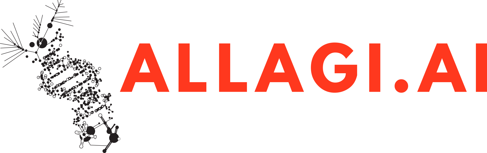

# AI molecular tumor board

How can we enable timely and cost-efficient access to precision oncology for every patient with complex cancer in the world?

Cancer is one of the most devastating diseases of our time disproportionately affecting lower income as well as ethnic minority populations.
An analysis published in JAMA Oncology in February 2023 estimates that, without further investment in research and prevention, cancer will cost the global economy an accumulated $25.2 trillion in health-care costs, lost labor, and spent savings over the next 30 years.

Every cancer is different, so effective treatment strategies can only be enabled by precision (personalized) medicine approaches.
Although precision oncology is becoming widely available to the wealthy parts of the population in countries like the US and Switzerland, being technologically and methodologically extremely labor intensive leaves it out of reach for the vast majority of the global population.
Aotearoa New Zealand only has the capacity for very few cancer patients to have access to the state of the art precision oncology approaches through a molecular tumor board (MTB), an interdisciplinary panel of experts who advise the lead oncologists on disease state, progression, and treatment options in the individual context.

We aspire to remove the main barrier to precision oncology becoming universally accessible – time human experts spend on linking individuals' clinical and genomic data to biomedical knowledge to come up with clinically actionable recommendations.

[Read more about and support us](https://solve.mit.edu/challenges/cure-challenge/solutions/80181) on our journey toward affordable and accessible precision oncology.

Allagi.ai is the winner of [MIT Solve Cure Xchange Challenge "Health AI for Good"](https://www.linkedin.com/posts/kumarseema_xchangechallenge-healthaiforgood-ai-activity-7167558802186170368-wyp3).
The only winner from outside the US.
Watch [the winner ceremony](https://www.youtube.com/watch?v=D7FDpUE1a-k) led by Cure CEO Seema Kumar with awards presented by Chelsea Clinton DPHIL, MPH from the Clinton Foundation.
